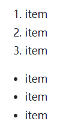
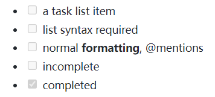
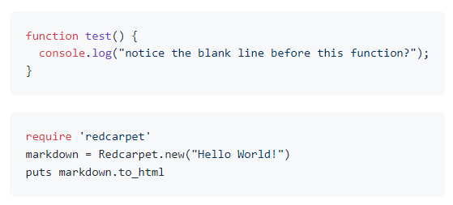
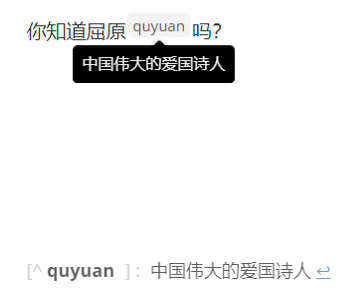
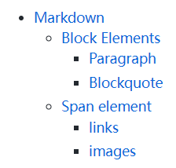

# Markdown语法入门


###### Created by [osedu](https://www.youtube.com/@osedu)　


---

# 什么是Markdown

Markdown是一种轻量级标记语言，允许人们使用易读易写的纯文本格式编写文档，然后转换成有效的XHTML（或者HTML）文档。吸收了很多在电子邮件中已有的纯文本标记的特性。

由于Markdown的轻量化、易读易写特性，并且对于图片，图表、数学式都有支持，目前许多网站都广泛使用Markdown来撰写帮助文档或是用于论坛上发表消息。如GitHub、Reddit、简书等，甚至还能被用来撰写电子书。


---

# Markdown标准化

Markdown规范有很多变种:  
- CommonMark规范：
    - [CommonMark.org](CommonMark.org)
- GitHub Flavored Markdown (GFM)：2017年，GitHub发布了基于CommonMark的`GFM`的正式规范。除了表格、删除线、自动链接和任务列表被GitHub规范作为扩展添加之外，它遵循CommonMark规范。
    - [https://help.github.com/articles/github-flavored-markdown/](https://help.github.com/articles/github-flavored-markdown/)

---

# 块元素：Block Elements

---

# 段落和换行

**段落 Paragraph**：一行或多行连续的文本。段落之间用两个空行分隔（一些工具支持段落之间用一个空行进行分割，例如:`typora`）。

**换行**：段落内部换行，行尾加两个空格并回车，或者使用`<br />`

<br />
<br />
<br />
<br />
<br />
<br />

---

# 标题
Markdown提供6种标题标记。
```markdown
# 1号标题

## 2号标题

### 3号标题

### 4号标题

##### 5号标题

###### 6号标题
```


---

# 块引用

```markdown
> Markdown是一种轻量级标记语言，允许人们使用易读易写的纯文本格式编写文档，然后转换成有效的XHTML（或者HTML）文档。吸收了很多在电子邮件中已有的纯文本标记的特性。

> 由于Markdown的轻量化、易读易写特性，并且对于图片，图表、数学式都有支持，目前许多网站都广泛使用Markdown来撰写帮助文档或是用于论坛上发表消息。如GitHub、Reddit、简书等，甚至还能被用来撰写电子书。
```

> Markdown是一种轻量级标记语言，允许人们使用易读易写的纯文本格式编写文档，然后转换成有效的XHTML（或者HTML）文档。吸收了很多在电子邮件中已有的纯文本标记的特性。

> 由于Markdown的轻量化、易读易写特性，并且对于图片，图表、数学式都有支持，目前许多网站都广泛使用Markdown来撰写帮助文档或是用于论坛上发表消息。如GitHub、Reddit、简书等，甚至还能被用来撰写电子书。

---

# 列表

## 有序列表
```markdown
1. item
1. item
1. item
```
## 无序列表

```markdown
- item
- item
- item
```
<br />
<br />



---

# 任务列表

```markdown
- [ ] a task list item
- [ ] list syntax required
- [ ] normal **formatting**, @mentions
- [ ] incomplete
- [x] completed
```
<br />
<br />



---

# 代码块

    ```js
    function test() {
    console.log("notice the blank line before this function?");
    }
    ```

    ```ruby
    require 'redcarpet'
    markdown = Redcarpet.new("Hello World!")
    puts markdown.to_html
    ```

<br />



---

# 数学公式
支持使用Latex数学公式语法编写数学公式。

    $$
    \mathbf{V}_1 \times \mathbf{V}_2 =  \begin{vmatrix}
    \mathbf{i} & \mathbf{j} & \mathbf{k} \\
    \frac{\partial X}{\partial u} &  \frac{\partial Y}{\partial u} & 0 \\
    \frac{\partial X}{\partial v} &  \frac{\partial Y}{\partial v} & 0 \\
    \end{vmatrix}
    $$

<br />

$$
\mathbf{V}_1 \times \mathbf{V}_2 =  \begin{vmatrix}
\mathbf{i} & \mathbf{j} & \mathbf{k} \\
\frac{\partial X}{\partial u} &  \frac{\partial Y}{\partial u} & 0 \\
\frac{\partial X}{\partial v} &  \frac{\partial Y}{\partial v} & 0 \\
\end{vmatrix}
$$
<!---->

---

# 表格1

    | First Header  | Second Header |
    | --------------| ------------- |
    | Content *Cell*  | ~~Content~~ Cell  |
    | **Content** Cell  | Content Content [Cell](http://www.123.net) |


| First Header  | Second Header |
| --------------| ------------- |
| Content *Cell*  | ~~Content~~ Cell  |
| **Content** Cell  | Content [Cell](http://www.123.net) |

---

# 表格2:对齐

    | First     Header  | Second Header |
    | :--------------| ------------- |
    | Content *Cell*  | ~~Content~~ Cell  |
    | **Content** Cell  | Content Content [Cell](http://www.123.net)  |


| First 　　 Header  | Second  　　   Header | Third  　　   Header |
| :--------------| :-------------: | -------------: |
| Content *Cell*  | ~~Content~~ Cell | Content Cell |
| 左对齐  | 居中对齐 | 右对齐 |

**注意**：Markdown中的表格标记比较简单，不支持单元格跨行和跨列。（Markdown更关注书写的内容）

---

# 脚注

    你知道屈原[^quyuan]吗？ 

    [^quyuan]: 中国伟大的爱国诗人

<br />
<br />
<br />
<br />



---

# 水平线和空格

## 水平线

    ---
    or
    ***

## 空格
Markdown只能识别一个空格,即使输入了多个空格最终仅显示一个空格。

- 输入html标记：`&nbsp;`
- 使用全角空格。即：在全角输入状态下直接使用空格键。

---

# YAML Front Matter

在文档的开始部分可以加入文档元数据:

> A YAML frontmatter is a series of **meta variables** that can be defined to describe information of the file that normally is not part of the text contents themselves, such as authors, keywords, and the title.

    ---
    layout: post
    title: Blogging Like a Hacker
    marp: true
    ---

参考：
- [https://jekyllrb.com/docs/front-matter/](https://jekyllrb.com/docs/front-matter/)
- [https://docs.zettlr.com/en/core/yaml-frontmatter/](https://docs.zettlr.com/en/core/yaml-frontmatter/)

---

# Table of Contents (TOC)

提取标题生成目录：

    [toc]
    # Markdown
    ## Block Elements
    ### Paragraph
    ### Blockquote 
    ## Span element
    ### links
    ### images



**提示**:`[toc]`不能自动生成目录编号。

---

# Span elements


---

# 链接 Links

```markdown
This is [an example](http://example.com/ "Title") inline link.

[This link](http://example.net/) has no title attribute.
```
This is [an example](http://example.com/ "Title") inline link.

[This link](http://example.net/) has no title attribute.

---

# 内部链接 Internal Links

实现页内跳转除了点击`[toc]`目录中的链接，还可以设置内部链接。

首先，定义页内锚点：
```html
<span id='ttt'></span>
<a name="Markdown"></a>
```

需要跳转的地方加入链接：
```markdown
[ttt](#ttt)
[Markdown](#Markdown)
```
跳转时：Ctrl键+鼠标左键

如果要跳转到特定的标题：`[test](#header_name)`

---

# 引用链接 Reference links

```markdown
This is [an example][id] reference-style link.

Then, anywhere in the document, you define your link label on a line by itself like this:

[id]: http://example.com/  "Optional Title Here"

[Google][]

And then define the link:

[Google]: http://google.com/
```

通常将`Reference links`放到文档的最后便于统一管理。

Ctrl键+鼠标左键: 在新的浏览器窗口打开链接。

--- 

# URLs

将URL用尖括号包裹，自动生成链接：
`<http://www.baidu.com>`
等价于：
`[http://www.baidu.com](http://www.baidu.com)`

<br />
<br />
<br />
<br />
<br />
<br />

---

# 图片 Images

```markdown


```

对于非Internet上的图片
- **推荐**使用相对路径：``. 


---

# 字体格式


```markdown
<!--斜体-->
*single asterisks*
_single underscores_


<!--粗体-->
**double asterisks**
__double underscores__

```

*single asterisks*
_single underscores_


<!--粗体-->
**double asterisks**
__double underscores__

---

# 行内代码

行内代码使用反单引号：

```markdown
This is a test program!`printf();`You can do it!
```
This is a test program!`printf();` You can do it!

<br />
<br />
<br />

---

# 删除线、下划线，上标、下标、高亮

<!--删除线-->
`~~Mistaken text.~~` becomes ~~Mistaken text.~~

<!--下划线-->
`<u>Underline</u>`.

标准的Markdown语法没有上标和下标标记：
- Markdown上标：使用 HTML 标签 <sup> 将需要作为上标的文字包裹起来。X<sup>2</sup>
- Markdown下标：使用 HTML 标签 <sub> 将需要作为下标的文字包裹起来。
- 在Typroa中可以（设置里打开扩展Markdown语法选项）：
    - 上标：`X^2^`
    - 下标：`H~2~O`, `X~long\ text~`/

高亮(非标准语法，需要编辑器支持）：`==highlight==`。Typora需要在设置里打开高亮语法开关。

---

# HTML

Markdown关于内容书写，很多HTML里的格式化排版在Markdown里是不支持的。可以直接在Markdown中使用HTML的格式化标记。

例如：`<span style="color:red">this text is red</span>`

**提示**：不推荐这样的用法。

---


## Find ME

#### Youtube: https://www.youtube.com/channel/UCqhEX79ardySrYr1_cJDNcw  
#### Github: https://github.com/osedu/
#### Twitter: https://twitter.com/osedu
#### Email: osedu2020 at gmail.com

