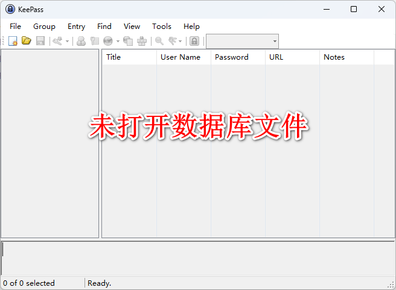
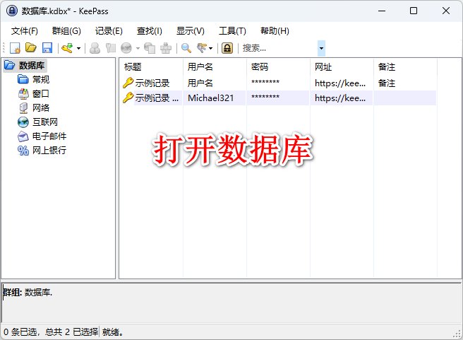
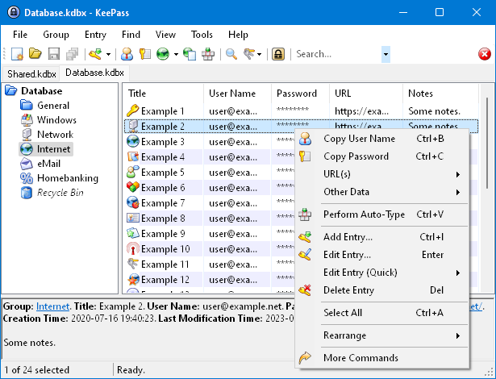
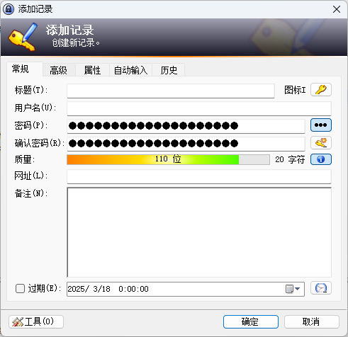
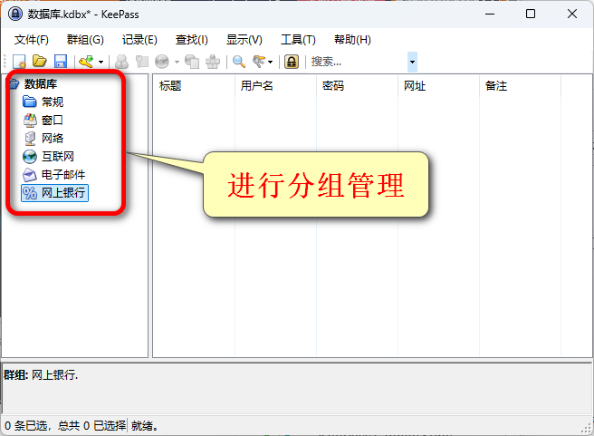
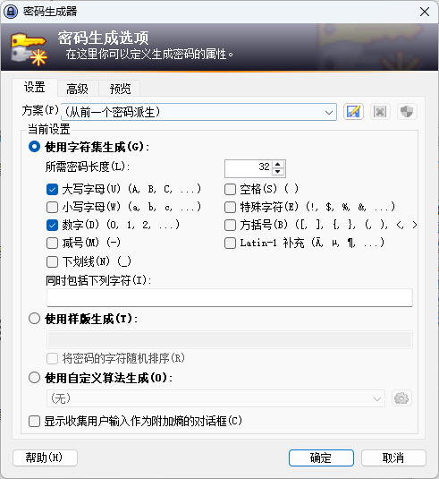
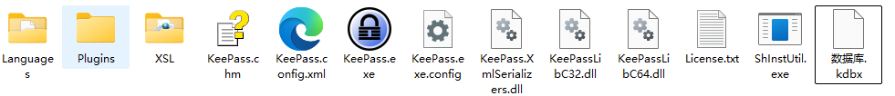
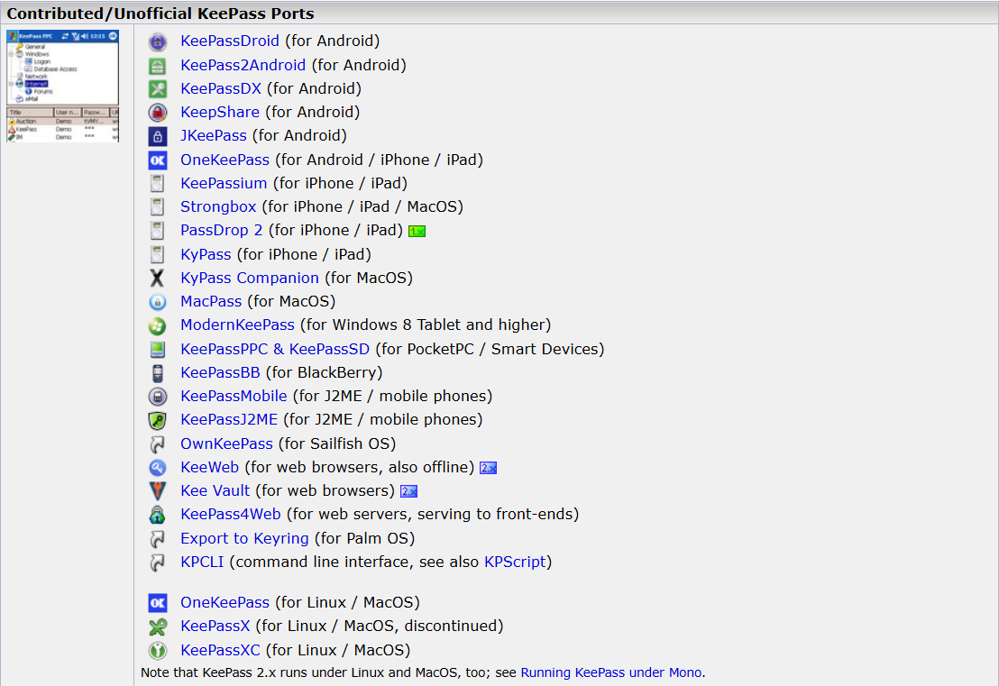

# KeePass：开源密码管理利器

## 一、KeePass简介

### 1. 什么是KeePass
KeePass是一款免费的开源密码管理软件，它允许用户将所有的密码和敏感信息存储在一个本地的强加密数据库文件，并通过一个主密码或密钥文件来访问。用户无需再费劲记忆众多复杂的密码，只需记住KeePass的主密码即可轻松管理各种账号信息。

### 2. KeePass的特点
 - **安全加密**：KeePass采用先进的加密算法（如AES等）对存储的密码数据进行加密，确保数据在本地和传输过程中的安全性。
 - **多平台支持**：支持多种操作系统，包括Windows、Mac OS、Linux、Android和iOS等，方便用户在不同设备上使用。
 - **免费且开源**：用户可以自由下载、使用和修改源代码，且无需支付任何费用。

## 二、KeePass的安装与界面介绍

### １.安装
1. 前往KeePass的官方网站（https://keepass.info/）下载适合当前操作系统的安装包。
2. 运行安装程序，按照提示进行安装。在安装过程中，你可以根据需要选择安装选项，如选择安装路径、是否创建桌面快捷方式等。

**备注：**也可以选择绿色便携版，下载后解压缩即可使用。

### ２.界面介绍

 - **菜单栏**：包含了文件操作（如新建、打开、保存密码数据库等）、工具（如密码生成、导入导出等）以及帮助等相关功能选项。
 - **密码条目列表区**：显示已存储的密码条目，方便用户查看和管理。
 - **详细信息区**：选中某个密码条目后，此处会显示该条目的详细信息，如用户名、网址、密码等。

## 三、KeePass的核心功能

### 1. 密码存储
用户可以轻松创建新的密码条目，只需输入相关的用户名、密码、网址等信息，KeePass会自动对其进行加密存储。

### 2. 密码分组与分类
为了更好地管理密码，KeePass支持对密码进行分组和分类。用户可以根据自己的需求创建不同的分组，如工作、生活、社交等，每个分组下可以再创建子分组，方便快速查找特定类型的密码。

### 3. 自动填充功能
在浏览网页或打开应用程序时，KeePass可以自动识别需要登录的字段，并自动填充相应的用户名和密码，大大提高了登录效率。

### 4. 密码生成
KeePass内置了强大的密码生成器功能，用户可以根据自己的需求设置密码的长度、复杂度等参数，生成安全可靠的随机密码。

## 四、数据安全与备份

### 1. 加密存储
KeePass采用强大的加密算法对密码数据库进行加密，即使数据文件丢失或被盗，如果没有正确的主密码或密钥文件，攻击者也无法解密其中的内容。

### 2. 本地备份
用户可以将密码数据库文件备份到本地其他位置，如外部硬盘、移动硬盘等，以防本地设备出现故障导致数据丢失。

### 3. 云服务同步
为了方便在不同设备上访问密码数据库，KeePass还支持与云服务进行同步。用户可以将密码数据库加密后上传到云服务提供商，然后在其他设备上登录相应的账号进行同步和访问。

## 六、跨平台使用

KeePass的跨平台特性使其在不同操作系统上都能保持一致的体验。用户可以在Windows系统上创建和编辑密码数据库，然后在手机或平板电脑上同步并使用，无需担心兼容性问题。

## 七、总结

KeePass作为一款开源密码管理软件，具有安全可靠、功能丰富、易于使用等优点。无论是个人用户还是企业用户，都可以使用KeePass来轻松管理密码，保障自己在网络世界中的安全。
